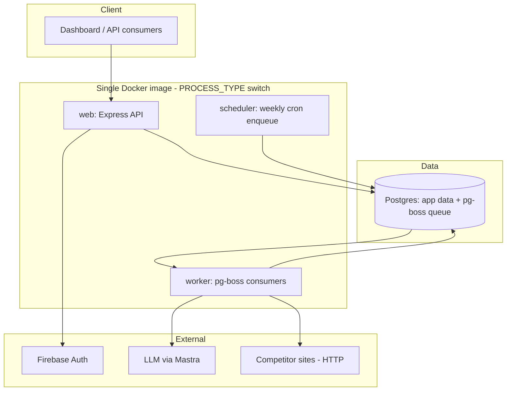
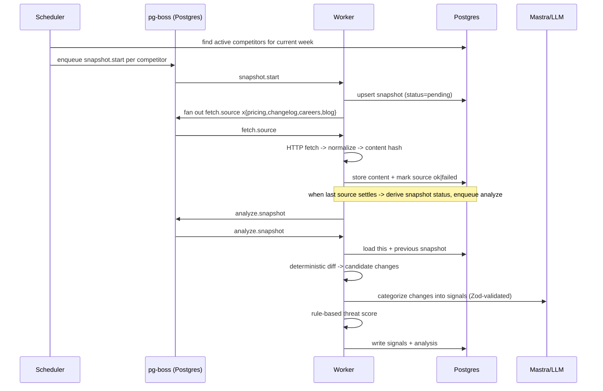
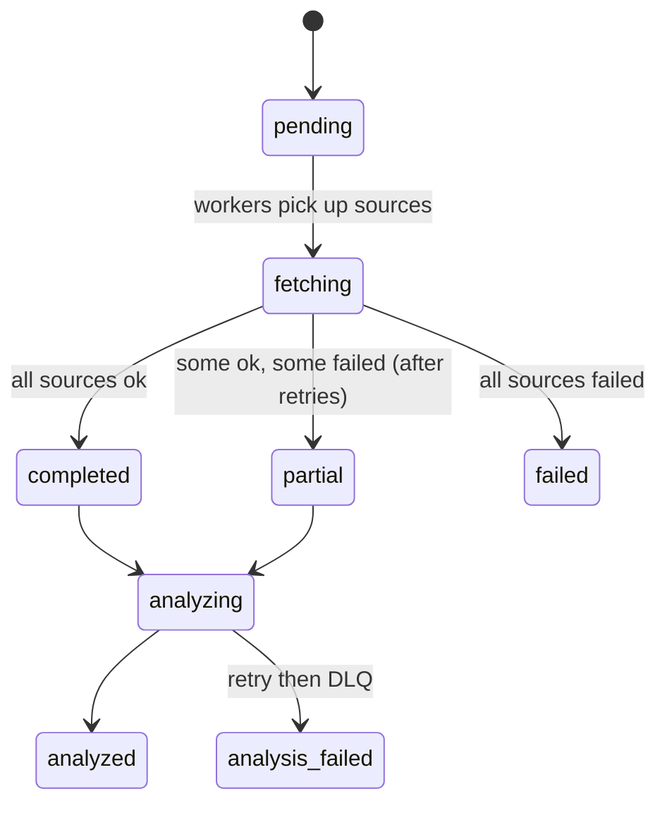
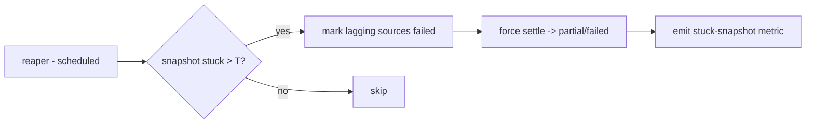
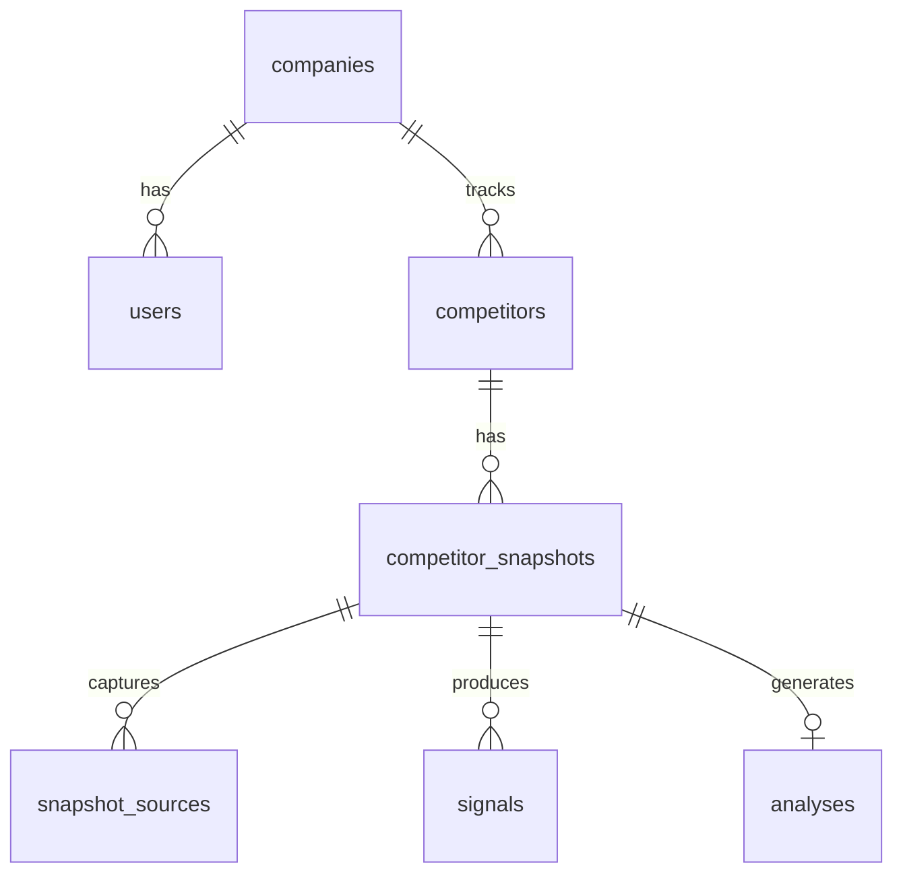

# Ripple — Architecture

Competitive intelligence API: companies track competitors, Ripple captures weekly
snapshots of their public surfaces (pricing, changelog, careers, blog), diffs them
against the prior week, and produces an AI-assisted threat analysis.

This document describes the target production architecture. It is the source of
truth for how the system is intended to fit together; some pieces are built and
some are planned (see [Status](#status)).

---

## Finalized decisions

The architecture is deliberately sized for **small scale with minimal infra** and
kept portable so the deploy target can be chosen later.

| Concern        | Decision                                                                                  |
| -------------- | ----------------------------------------------------------------------------------------- |
| Queue          | **pg-boss** — runs on the existing Postgres. No Redis, no new infra.                       |
| Processes      | One Docker image; `PROCESS_TYPE` selects `web` / `worker` / `scheduler`.                   |
| Raw storage    | Normalized content stored in Postgres, behind a `BlobStore` interface (swap to S3 later).  |
| Scraping       | Plain HTTP fetch + main-content extraction + sanitize. No headless browser.                |
| Scoring        | **Hybrid** — LLM categorizes changes into signals; a deterministic function scores threat. |
| Deploy         | 12-factor, Dockerized, no cloud-specific services. Portable until a host is chosen.        |

**Scale assumption:** < 100 companies, < 2k competitors total, weekly cadence
(~8k source fetches/week). One worker process handles this comfortably.

---

## High-level architecture

The synchronous API is separated from the asynchronous ingest/analysis pipeline.
Scraping and LLM calls are slow, flaky, and bursty, so they never run inside an
HTTP request. All process types share one codebase and image.



### Components

- **web** — Express API. Auth, competitor CRUD, snapshot/analysis reads. Stateless,
  horizontally scalable.
- **scheduler** — weekly cron that enqueues one `snapshot.start` job per active
  competitor. Idempotent so a double-fire is harmless.
- **worker** — pg-boss consumers that run the pipeline (fetch, diff, analyze).
- **Postgres** — system of record *and* the job queue (via pg-boss).
- **Firebase Auth** — user identity; admin SDK verifies ID tokens, sign-in proxies
  Google Identity Toolkit.
- **Mastra + LLM** — categorizes detected changes into structured signals.

---

## The weekly pipeline



### Snapshot state machine



When the **last** source for a snapshot settles, the worker derives the snapshot
status and enqueues `analyze.snapshot`. The "last one in" check runs in the same
transaction that updates the source (e.g. `COUNT(*) FILTER (WHERE status='pending') = 0`)
to avoid double-enqueue or never-enqueue.

---

## Jobs

All jobs are idempotent and keyed so at-least-once delivery is safe.

| Job                | Idempotency key          | Concurrency   | Retry                              |
| ------------------ | ------------------------ | ------------- | ---------------------------------- |
| `snapshot.start`   | `competitorId:weekStart` | high          | 3x exponential backoff             |
| `fetch.source`     | `snapshotId:sourceKey`   | high (I/O)    | 5x backoff + jitter, per-domain cap |
| `analyze.snapshot` | `snapshotId`             | low (LLM)     | 3x backoff, then DLQ               |

- **Idempotency** comes from job keys + DB upserts (`ON CONFLICT`).
- **Dead-letter:** exhausted jobs are retained with context for inspection/replay.
- **Politeness:** per-domain rate limit, jittered backoff, realistic UA, `robots.txt`
  respect, per-competitor concurrency cap.

### Failure path & liveness (must-have, not optional)

The settle step only advances when no source is still `pending`. So **any source
that gets stuck `pending` freezes the whole snapshot** — analysis never enqueues and
nothing alerts. Two mechanisms prevent this:

1. **Terminal source failure is owned by our code, not the queue.** A `fetch.source`
   handler must mark its source row `failed` when it has exhausted retries, rather
   than relying on pg-boss to signal "this was the last attempt." The handler reads
   the current attempt count and, on the final attempt, writes `failed` in the same
   path that would otherwise re-throw. If the process dies mid-handler, the reaper
   (below) is the backstop. See [LLD §5.6](./LLD.md#56-terminal-failure--reaper).
2. **A reaper sweeps stuck work.** A scheduled job finds snapshots that have been
   `pending`/`fetching`/`analyzing` past a timeout, marks lagging sources `failed`,
   forces a settle, and emits an alert metric. This guarantees liveness even if a
   worker crashes or a job vanishes.



---

## Ingestion (HTTP only)

A `SourceFetcher` strategy per source type (pricing, changelog, careers, blog):

```ts
interface SourceFetcher {
  key: TrackedSourceKey;
  fetch(url: string, ctx: FetchContext): Promise<FetchResult>;
  // FetchResult = { raw, normalized, contentHash }
}
```

- **Normalize before hashing/diffing:** strip nav/footer/ads, collapse whitespace,
  extract main content. Diff quality depends entirely on this step.
- **Content hash short-circuit:** if `contentHash` equals last week's, skip diff and
  the LLM call entirely. This is the biggest cost lever.
- **Timeouts + size caps** on every fetch. Per-source failures are recorded so one
  bad URL produces a `partial` snapshot, not a failed one.

### SSRF protection (hard control, ships with the fetcher)

URLs are **tenant-supplied** and fetched from inside our worker network, so an
unguarded fetcher is a credential-exfil hole (e.g. `http://169.254.169.254/` cloud
metadata, internal services, `localhost`). This is a blocking control, not best-effort:

- **Scheme allowlist:** only `http`/`https`.
- **DNS-resolve-then-check:** resolve the host and reject if *any* resolved IP is
  private/reserved/loopback/link-local (RFC1918, `127.0.0.0/8`, `::1`,
  `169.254.0.0/16`, `fc00::/7`, etc.). Re-validate on every redirect hop.
- **Pin the connection to the validated IP** to defeat DNS-rebinding (resolve →
  validate → connect to that exact IP), and cap redirects.
- Validation happens at competitor create/update time *and* again at fetch time
  (DNS can change between the two).

`robots.txt` is a politeness signal, **not** a security control — SSRF filtering is
mandatory regardless. See [LLD §6.1](./LLD.md#61-ssrf-guard).

---

## Diff engine

Operates on **normalized** content of `(thisWeek, previousWeek)` per source and
produces deterministic candidate changes (added / removed / modified). No LLM here.

- **pricing** — structured price/table diff
- **changelog / blog** — new-entry detection
- **careers** — job-listing set diff

This keeps the LLM focused on *interpreting* real changes rather than *finding* them.

---

## Analysis & hybrid scoring

The LLM never emits the score. It only **labels** changes into signals; the score is
a pure function of those **stored** signals.

1. **Mastra workflow** (Zod-validated output) turns candidate changes into:
   `signals[] = { source_key, category, change_type, severity, payload }` plus a
   single `summary` string for the snapshot.
2. **Deterministic scorer** computes the threat score and per-category breakdown
   from the persisted `signals` rows.

### What "deterministic" means here

The LLM step is **not** deterministic — `severity` and `category` come from a model.
Determinism applies to the **scorer**, which is a pure function of the `signals`
already written to the database:

```
score = f(signals_in_db)        -- same rows in -> same number out, forever
```

Because signals are persisted, re-scoring history later (e.g. a new scoring policy
version) is reproducible without re-calling the LLM. Re-running the LLM (retry/DLQ)
*can* produce different signals; that is a new categorization, versioned by
`analyses.model` + `analyses.prompt_version`, not a silent overwrite of the old score
(see [Re-scoring & provenance](#re-scoring--provenance)).

### The formula (single source of truth)

```
raw   = Σ_signals ( CATEGORY_WEIGHT[category] × (severity / 5) )
score = round( min(1, raw / SCALE) × 100 )      -- clamped to 0..100
```

- `severity ∈ 1..5` (from the LLM), `CATEGORY_WEIGHT ∈ [0,1]` (see LLD §8.2).
- `SCALE` is the `raw` value that should map to a "100" (max threat) week. It is a
  **tunable constant, fixed per scoring-policy version**. v1 default: `SCALE = 3.0`
  (derivation and a worked example in [LLD §8.3](./LLD.md#83-worked-scoring-example)).
- There is **no `recency_decay` term in v1.** A single snapshot is scored only
  against its immediate previous week, so a decay factor would always be `1`. It is
  deferred to a future multi-week rollup policy.

### Re-scoring & provenance

- `analyses` is keyed `UNIQUE (snapshot_id, policy_version)` — a new policy inserts a
  new row rather than overwriting, so historical scores stay comparable.
- Provenance recorded per analysis: `model`, `prompt_version`, `policy_version`.
  Changing the prompt or model starts a new categorization lineage; changing only
  weights/`SCALE` starts a new scoring lineage that can re-run over stored signals.

### Score is a triage key, not the headline

The scalar is for sorting/triage. The product surface leads with the **specific
change** ("Acme dropped enterprise pricing ~20%") drawn from the per-category
signals; the score is secondary.

---

## Data model

Existing tables: `companies`, `users`, `competitors`, `competitor_snapshots`.
Multi-tenancy: every query is scoped by `company_id`.



### Planned additions (migrations 006–008)

`snapshot_sources` promotes per-source state out of the `competitor_snapshots.sources`
JSONB blob so each source is independently queryable, retryable, and free of
read-modify-write races when multiple fetch workers update the same snapshot.

```sql
-- 006 raw source captures (one row per source per snapshot)
CREATE TABLE snapshot_sources (
  id UUID PRIMARY KEY DEFAULT gen_random_uuid(),
  snapshot_id UUID NOT NULL REFERENCES competitor_snapshots(id) ON DELETE CASCADE,
  source_key TEXT NOT NULL,              -- pricing|changelog|careers|blog
  status TEXT NOT NULL DEFAULT 'pending',-- pending|ok|failed
  content_hash TEXT,                     -- dedupe: skip diff if unchanged
  storage_key TEXT,                      -- BlobStore pointer to raw payload
  fetched_at TIMESTAMPTZ,
  error TEXT,
  UNIQUE (snapshot_id, source_key)
);

-- 007 normalized changes detected between snapshots
CREATE TABLE signals (
  id UUID PRIMARY KEY DEFAULT gen_random_uuid(),
  snapshot_id UUID NOT NULL REFERENCES competitor_snapshots(id) ON DELETE CASCADE,
  source_key TEXT NOT NULL,
  category TEXT NOT NULL,                -- pricing_change|new_feature|hiring|...
  change_type TEXT NOT NULL,            -- added|removed|modified
  payload JSONB NOT NULL,
  created_at TIMESTAMPTZ NOT NULL DEFAULT NOW()
);
CREATE INDEX signals_snapshot_id_idx ON signals(snapshot_id);

-- 008 scored output per snapshot vs previous
CREATE TABLE analyses (
  id UUID PRIMARY KEY DEFAULT gen_random_uuid(),
  snapshot_id UUID NOT NULL REFERENCES competitor_snapshots(id) ON DELETE CASCADE,
  previous_snapshot_id UUID REFERENCES competitor_snapshots(id) ON DELETE SET NULL,
  threat_score INT NOT NULL,            -- 0-100
  breakdown JSONB NOT NULL,             -- per-category contribution
  summary TEXT NOT NULL,
  is_baseline BOOLEAN NOT NULL DEFAULT false, -- week 1 / no prior snapshot
  model TEXT NOT NULL,                  -- categorization provenance (LLM model)
  prompt_version TEXT NOT NULL,         -- categorization provenance (prompt)
  policy_version TEXT NOT NULL,         -- scoring provenance (weights/SCALE)
  created_at TIMESTAMPTZ NOT NULL DEFAULT NOW(),
  -- new scoring policy inserts a new row instead of overwriting history
  UNIQUE (snapshot_id, policy_version)
);
```

---

## API layer

Conventions to apply uniformly across routes:

- **Central error middleware** maps typed domain errors (e.g. `CompetitorNotFoundError`)
  to consistent JSON responses with correct status codes.
- **`asyncHandler`** wrapper so rejected promises reach the error middleware.
- **Zod `validate()` middleware** parses `body` / `params` / `query` on every route.
- **Cursor pagination** on list endpoints, ordered by `created_at, id`.
- **RBAC** enforced in middleware. `users.role` exists; define owner/admin/member
  with read vs write even if minimal at first.
- **Rate limiting** on auth routes (signup/signin proxy Firebase and attract abuse).

---

## Cross-cutting concerns

- **Config:** validate all env at boot with a Zod-parsed config module; fail fast.
- **Migrations:** run as a deploy step (not inside `start()`), guarded by
  `pg_advisory_lock`, so multiple replicas do not race to apply DDL.
- **Observability:** structured JSON logs with request/job correlation IDs; metrics
  (queue depth, fetch success rate, LLM latency/cost, snapshot completion);
  `/health` + `/ready` endpoints.
- **Security:** `helmet`, CORS allowlist, request size limits, per-tenant isolation
  tests, secrets via env/secret manager (never committed).
- **Testing:** unit (diff, scorer, week boundaries), integration (DB + queue via
  testcontainers), contract (Mastra structured output), e2e pipeline with fixtures.

---

## Deployment

Portable by design — runnable on any container host (PaaS, ECS/Fargate, Cloud Run,
or Kubernetes) without code changes.

- Single image, process type chosen via `PROCESS_TYPE` (`web` | `worker` | `scheduler`).
- Postgres is the only required dependency (app data + queue).
- 12-factor config via environment variables.

### Load-triggered upgrades (not built now)

Introduce only when metrics justify it:

- **S3 BlobStore** for raw payloads as snapshot volume grows.
- **Read replica / PgBouncer** when analysis reads or worker count strain the primary.
- **Redis + BullMQ** if queue throughput outgrows pg-boss.
- **Headless rendering** (Playwright) for JS-heavy competitor sites.

---

## Phasing

1. **Foundations** — error/validate middleware, config module, pagination,
   migrations-on-deploy, dependency cleanup.
2. **Pipeline** — pg-boss, scheduler + worker process types, `snapshot_sources`,
   HTTP fetcher + normalize + hashing.
3. **Intelligence** — diff engine + `signals` / `analyses` + Mastra categorization +
   rule scorer; replaces the stubbed `analysisService`.
4. **Scale & ops** — load-triggered upgrades above, RBAC expansion, DLQ tooling.

---

## Status

| Area                              | State                                        |
| --------------------------------- | -------------------------------------------- |
| Auth (signup/signin)              | Built                                        |
| Competitor CRUD                   | Built                                        |
| Snapshot persistence + schema     | Built (JSONB sources)                        |
| Weekly boundary helper            | Built                                        |
| Migrations on boot                | Built (to move to deploy step)               |
| Queue / scheduler / worker        | Planned                                      |
| HTTP ingestion + normalization    | Planned                                      |
| Diff engine                       | Planned                                      |
| `snapshot_sources` / `signals` / `analyses` tables | Planned                     |
| Mastra analysis + hybrid scoring  | Planned (`analysisService` is stubbed)       |
