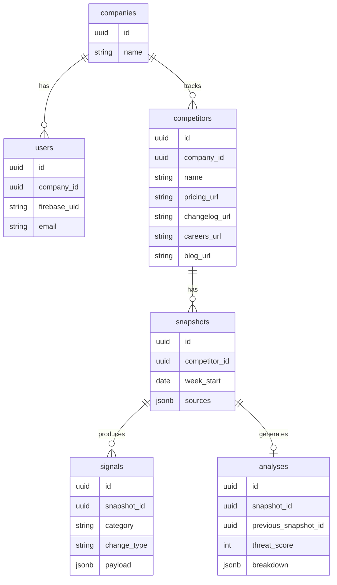

# Ripple

TypeScript API server for competitor tracking and analysis. Built with Express, Firebase Auth, and PostgreSQL.

## Prerequisites

- [Node.js](https://nodejs.org/) 18 or later
- npm
- [Docker](https://www.docker.com/) (for local PostgreSQL)
- A [Firebase](https://console.firebase.google.com/) project with Email/Password auth enabled

## Getting started

Install dependencies:

```bash
npm install
```

Copy the environment file and fill in your Firebase credentials:

```bash
cp .env.example .env
```

Start PostgreSQL:

```bash
docker compose up -d
```

Run in development mode (auto-reload on file changes):

```bash
npm run dev
```

The server starts at [http://localhost:3000](http://localhost:3000). Database migrations run automatically on startup.

## Environment variables

| Variable | Description |
| --- | --- |
| `DATABASE_URL` | PostgreSQL connection string |
| `FIREBASE_PROJECT_ID` | Firebase project ID |
| `FIREBASE_CLIENT_EMAIL` | Firebase service account email |
| `FIREBASE_PRIVATE_KEY` | Firebase service account private key |
| `FIREBASE_API_KEY` | Firebase Web API key |

See `.env.example` for the default local `DATABASE_URL`.

## Scripts

| Command | Description |
| --- | --- |
| `npm run dev` | Run the server with hot reload via `tsx` |
| `npm run build` | Compile TypeScript to `dist/` |
| `npm start` | Run the compiled server |
| `npm run typecheck` | Type-check without emitting files |
| `npm run migrate` | Run database migrations manually |

## API

### Auth

| Method | Path | Auth | Description |
| --- | --- | --- | --- |
| `POST` | `/auth/signup` | No | Create a new user |
| `POST` | `/auth/signin` | No | Sign in and receive a Firebase ID token |

**Sign up**

```bash
curl -X POST http://localhost:3000/auth/signup \
  -H "Content-Type: application/json" \
  -d '{"email":"you@example.com","password":"password123","companyName":"Acme Inc"}'
```

Creates a Firebase user, a company, and links the user as `owner`.

**Sign in**

```bash
curl -X POST http://localhost:3000/auth/signin \
  -H "Content-Type: application/json" \
  -d '{"email":"you@example.com","password":"password123"}'
```

Returns a Firebase ID token, user profile, and company.

### Competitors

| Method | Path | Auth | Description |
| --- | --- | --- | --- |
| `GET` | `/competitors` | Yes | List competitors for your company |
| `POST` | `/competitors` | Yes | Create a competitor |
| `PATCH` | `/competitors/:id` | Yes | Update a competitor |
| `DELETE` | `/competitors/:id` | Yes | Delete a competitor |

**Create**

```bash
curl -X POST http://localhost:3000/competitors \
  -H "Content-Type: application/json" \
  -H "Authorization: Bearer <firebase-id-token>" \
  -d '{"name":"LanceDB","website":"https://lancedb.ai"}'
```

### Analysis

| Method | Path | Auth | Description |
| --- | --- | --- | --- |
| `GET` | `/analysis` | Yes | Analysis for all competitors |
| `GET` | `/competitors/:id/analysis` | Yes | Analysis for a single competitor |

Protected routes require a Firebase ID token:

```bash
curl http://localhost:3000/competitors/<id>/analysis \
  -H "Authorization: Bearer <firebase-id-token>"
```

## Project structure

```
src/
├── index.ts                 # Express app entry point
├── controller/
│   ├── analysis.ts
│   ├── competitor.ts
│   └── auth/
│       ├── signin.ts
│       └── signup.ts
├── service/
│   ├── analysisService.ts
│   ├── competitorService.ts
│   └── userService.ts
├── schema/                  # Zod validation schemas
├── lib/
│   ├── auth.ts              # Firebase auth helpers
│   ├── db.ts                # PostgreSQL connection pool
│   ├── firebase.ts          # Firebase Admin SDK
│   └── migrate.ts           # Database migrations
├── middleware/
│   └── auth.ts              # Firebase token verification
└── types/
    └── express.d.ts
migrations/                  # SQL migration files
```

## Tech stack

- **TypeScript** — strict type checking
- **Express** — HTTP server
- **PostgreSQL** — competitor persistence
- **Firebase Auth** — user authentication
- **Zod** — request validation
- **Mastra** — AI agent framework

## Data model

Per company, the data hierarchy looks like this:



**What this means**

- **Company** is the tenant boundary — competitors, snapshots, and analyses all belong to a company
- **Users** belong to one company (linked to Firebase)
- **Competitors** are tracked per company, with user-provided URLs (`pricing_url`, `changelog_url`, `careers_url`, `blog_url`)
- **Snapshots** are captured weekly per competitor
- **Signals** are normalized changes extracted when comparing snapshots
- **Analyses** are the scored output (threat level, breakdown, summary) for a snapshot vs the previous week

Two companies can track the same competitor independently. All API queries are scoped to the authenticated user's company.

## License

ISC
